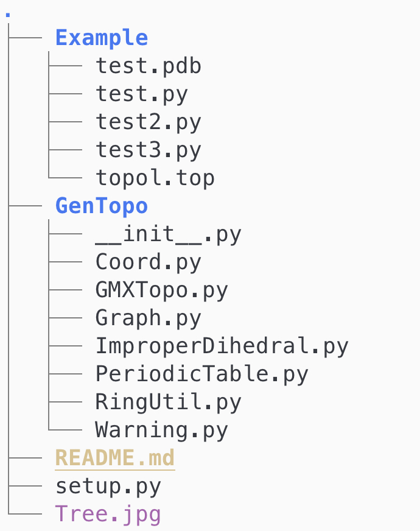

# GenTopo
A lightweight python toolkit for generating gromacs topology template.

### Code Organization
---

 

&nbsp;

### Installation 
---

```bash 
git clone https://github.com/masrul/GenTopo 
cd GenTopo
pip install . 
```

&nbsp;

### Usages 
---

**Case-1: Creating gromacs topology template**

**GenTopo** is primarily used for creating gromacs topology template. It requires a PDB file of molecule, which has two extra entries after 80th column 
respectively atomTypes and charges. An example PDB file can be found in Example/test.pdb.
It is recommended to have connectivity information in the PDB file, but not manadatory. If connectivity is 
missing, then code will generate connectivity information using heuristic of Van der Waals  
radius of atoms. In addition to internal coordinates, it also creates all required bondTypes, angleTypes, and dihedralTypes. **GenTopo** is independent of particular force filed, it simply creates template. User needs to provide required parameters once template is created. An example topology template created by **GenTopo** can be found in Example/topol.top.  

```python 
# File name: Example/test.py
from GenTopo.Coord import PDBobj
from GenTopo.Graph import MolGraph
from GenTopo.GMXTopo import Topo


# load a PDB file
mol = PDBobj("test.pdb") 

# Pass mol object to Graph for generating bond, angles, dihedral etc. 
# User can also request for creating improper dihedral for aromatic molecules. 
graph = MolGraph(mol, guessImpropers=True)

# Now create gromacs topology by passing mol and graph 
gmx = Topo(mol, graph)

# write topology file 
gmx.write("topol.top")
```


&nbsp;

**Case-2: Using molecular graph for any topology template** 

**GenTopo** can also be used for creating other topology format, such as NAMD PSF, Lammps data file. 
Once molecular-graph is created by **GenTopo**, user can post-process for particular file format.  

```python
# File name: Example/test2.py
from GenTopo.Coord import PDBobj
from GenTopo.Graph import MolGraph

mol = PDBobj("test.pdb") 
graph = MolGraph(mol, guessImpropers=True)

# accessing bonds 
for bond in graph.bonds: 
    pass   #process as needed by user  

# accessing angles  
for angle in graph.angles:
    pass 

# accessing dihedrals   
for dihedral in graph.dihedrals:
    pass 
```

&nbsp;

**Case-3: Creating graph from bond list rather than PDB file** 

**GenTopo**'s MolGraph can be initialized with plain python list in addition to PDB object. 


```python 
# File name: Example/test3.py
from GenTopo.Graph import MolGraph

# Define bonds as python list 
bonds = [(1, 2), (2, 3), (3, 4), (4, 5), (5, 6), (6, 1)]

# Create graph from bond list 
graph = MolGraph(bonds)

# Write/Process as needed 
graph.write("graph.dat")
```


### Copyright 
Masrul Huda (c) 2021


